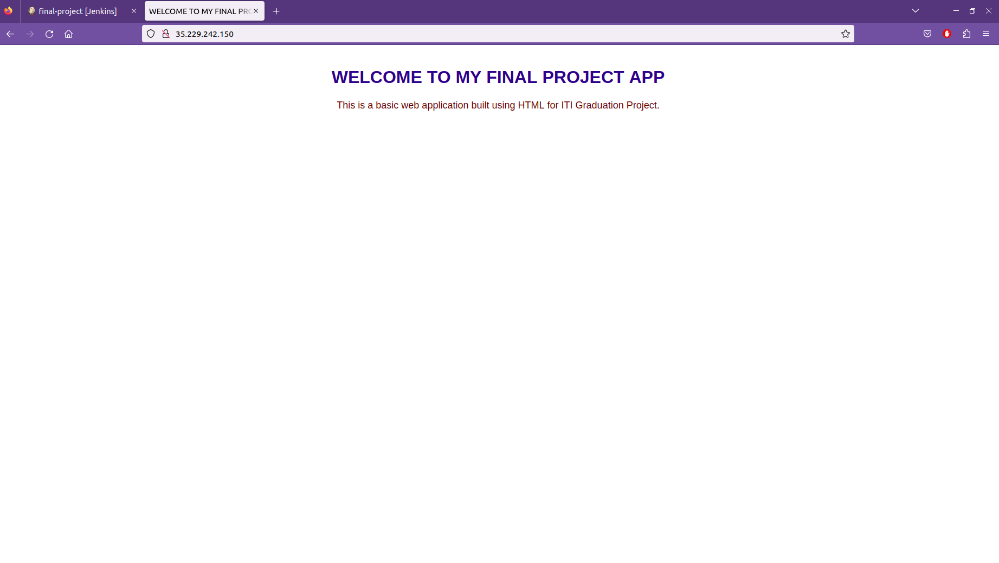

# Finale-Project-App
## this repo contains a basic web application built using HTML [index.html](index.html)
## we use [Jenkinsfile](Jenkinsfile) to deploy this basic web app
### the jenkinsfile first stage "build" :
1- It gets the credintial of docker which added to jenkins gui.

2- It builds the image to my dockerhub profile and give the image the a tag of my build number using [Dockerfile](Dockerfile).
      
      docker build -t mohamedshaltout/myapp:${BUILD_NUMBER} .

3- It pushes it to dockerhub 
      
      docker push mohamedshaltout/myapp:${BUILD_NUMBER}
      
4- Then it takes the build number variable and adds it to proj-build-number.txt
### the jenkinsfile first stage "deploy" :
1- It checks if the namespace "myapp" is exist it skip the creation of namespace, if it's not exist it create this namespace.

2- It takes the value of build number variable from proj-build-number.txt and write it inside [deploy.yaml](Deployment/deploy.yaml) in the image name.

3- then make the deployment for directory [Deployment](Deployment/) 
      
      kubectl apply -f Deployment

## You can check the screenshots of this process in [app-images](app-images/)
# SCREENSHOT OF THE SIMPLE APP
  
